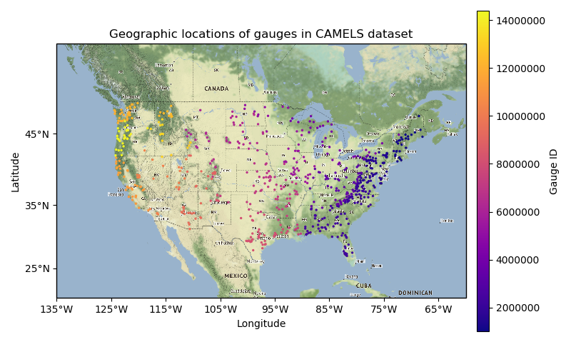

 [](https://ci.appveyor.com/project/simonpf/camels)

# The CAMELS dataset

This package provides an interface to the Catchment Attributes and Meteorology
for Large-sample Studies (CAMELS) dataset. This package only provides simplified
access to the data in Python, the actual work of generating the dataset has been
done by Andrew Newman and colleagues  at NCAR and is described in the following
article:

[A. Newman; K. Sampson; M. P. Clark; A. Bock; R. J. Viger; D. Blodgett, 2014. A
large-sample watershed-scale hydrometeorological dataset for the contiguous USA.
Boulder, CO: UCAR/NCAR](https://dx.doi.org/10.5065/D6MW2F4D)

## Usage

### Pytorch

```
from camels.pytorch import Streamflow
gauge_id = 13331500

training_data = Streamflow(gauge_id, "training")
validation_data = Streamflow(gauge_id, "validation")
test_data = Streamflow(gauge_id, "testing")
```



